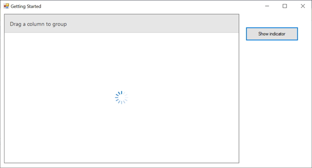

# how-to-add-busy-indicator-for-winforms-datagrid
How to add busy indicator for WinForms DataGrid (SfDataGrid)?

SfDataGrid have the built-in support to enable the busy indicator when the data in the grid is updating with some actions (filtering, initialing data, etc.) by using the ShowBusyIndicator property. In order to add a busy indicator for your custom actions, the BusyIndicator control can be used. The Show()/Hide() methods can be used based on our requirement.

```C#
//To add built-in busy indicator
sfDataGrid.ShowBusyIndicator = true;

//OR

//To add busy indicator control for SfDataGrid based on requirement.
buysIndicator.Show(sfDataGrid.TableControl);
var data = new OrderInfoCollection();
sfDataGrid.DataSource = data.OrdersListDetails;
//To hide the busy indicator after the process is completed.
buysIndicator.Hide();
```


